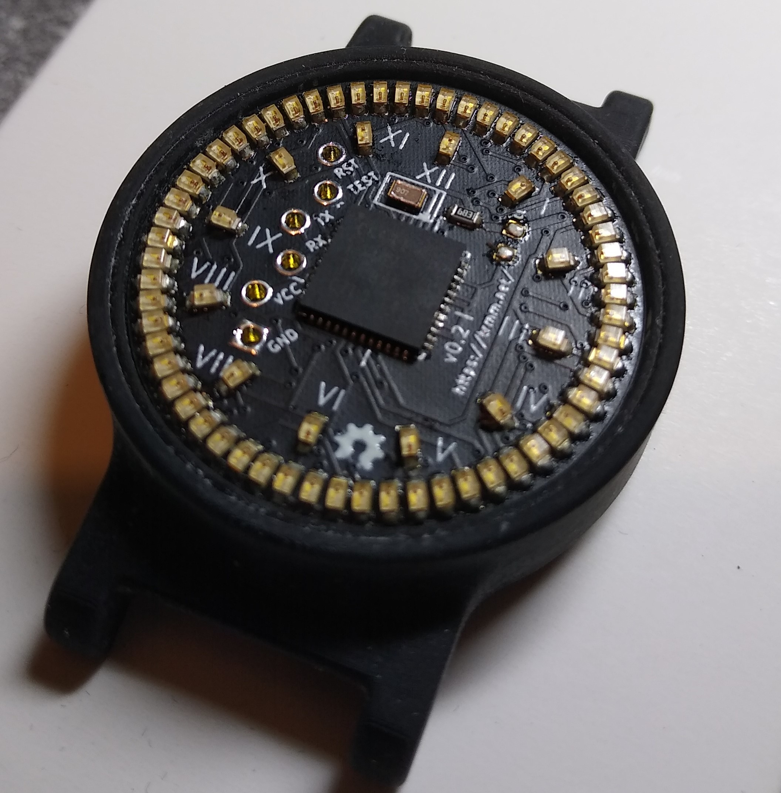

Charliewatch
---

An "Analog" watch with 72 (60+12) Charlieplexed LEDs. Based on Travis Goodspeed's
GoodWatch21 schematic, using the CC430F5137IRGZR CPU, which doesn't have the LCD
controller of the CC430F6xxx in the GoodWatch.

v0.2 works, although it has no radio parts.  It is exactly 1 square inch
of PCB and should fit in a 38mm or 36mm case.

See it in action: https://www.youtube.com/watch?v=VaebR-6KNXE

[Charliewtch schematic](datasheets/charliewatch.pdf)

Bill Of Materials (BOM)
---
- CC430F5137IRGZR [https://www.mouser.co.uk/ProductDetail/595-CC430F5137IRGZR](https://www.mouser.co.uk/ProductDetail/595-CC430F5137IRGZR)

- 0603 68k Resistor [ERA3AEB683V](https://uk.farnell.com/panasonic/era3aeb683v/res-68k-0-1-0-1w-0603-thin-film/dp/1577630)

- 0603 Red LED [KP-1608EC](https://uk.farnell.com/kingbright/kp-1608ec/led-red-8mcd-625nm-smd/dp/2463988)

- KEYSTONE  3002  Battery Contact, Coin Cell - 20mm, SMD [3002](https://uk.farnell.com/keystone/3002/battery-smd-retainer-20mm/dp/1650693)

- IQD FREQUENCY PRODUCTS  LFXTAL050789  Crystal, 32.768 kHz, SMD, 2mm x 1.2mm, 12.5 pF, 20 ppm, IQXC-25 Series [LFXTAL050789](https://uk.farnell.com/iqd-frequency-products/lfxtal050789/crystal-32-768khz-12-5pf-smd/dp/2449502)

- Push button - Omron [B3U3100P](https://uk.farnell.com/omron/b3u-3000p/tactile-switch-side-actuated-smd/dp/1333655)

Programming
---

Programmed via TI Code Composer Studio using the Programmer/Debugger on the MSP430 FR4133 Launchpad.
http://www.ti.com/tool/MSP-EXP430FR4133

Programming cable
---

From the top of the board: (Wiring from watch to Programmer/Debugger on MSP430 FR4133 Launchpad) 
* TST - SBWTCK
* RST - SBWTDIO
* RX - RXD
* TX - TXD
* VCC - 3V3
* GND - GND

There is also a four-wire setup that might simplify the wiring.
Travis documents it and the power consumption here:
https://github.com/travisgoodspeed/goodwatch/wiki/EnergyTrace

Bricked Launchpad
-----

If you brick your launchpad by running Energia under Linux, it will no
longer program the Charliewatch.  The other weirdness is that `tilib`
can detect the device, but can't write to it unless run as root.

Energy Trace
----
* `libmsp430.so`: https://dlbeer.co.nz/articles/slac460y/index.html
* https://github.com/carrotIndustries/energytrace-util
* Have to update path to `MSP430.h` from the `slac/DLL430_v3/include` directory

