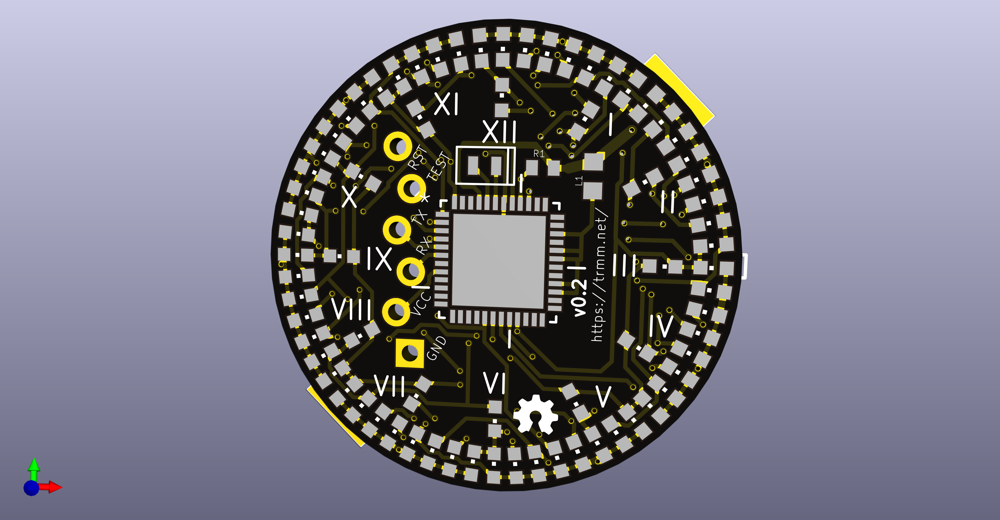

Tweaked the Silkscreen on the PCB and used Roman Numerals (in kicad).

"Analog" watch with 60+12 Charlieplexed LEDs. Based on Travis Goodspeed's
GoodWatch21 schematic, using the CC430F5137IRGZR CPU, which doesn't
have the LCD controller of the CC430F6xxx in the GoodWatch. There are
also pads for a six pin EZfet cable with pogopins for programming or
serial communication.

v0.2 works, although it has no radio parts.  It is exactly 1 square inch
of PCB and should fit in a 38mm or 36mm case.

[Charliewtch schematic](datasheets/charliewatch.pdf)

Programming
---

Programmed via TI Code Composer Studio using the Programmer/Debugger on the MSP430 FR4133 Launchpad.
http://www.ti.com/tool/MSP-EXP430FR4133

Programming cable
---

From the top of the board: (Wiring from watch to Programmer/Debugger on MSP430 FR4133 Launchpad) 
* TST - SBWTCK
* RST - SBWTDIO
* RX - RXD
* TX - TXD
* VCC - 3V3
* GND - GND

There is also a four-wire setup that might simplify the wiring.
Travis documents it and the power consumption here:
https://github.com/travisgoodspeed/goodwatch/wiki/EnergyTrace

Bricked Launchpad
-----

If you brick your launchpad by running Energia under Linux, it will no
longer program the Charliewatch.  The other weirdness is that `tilib`
can detect the device, but can't write to it unless run as root.

Energy Trace
----
* `libmsp430.so`: https://dlbeer.co.nz/articles/slac460y/index.html
* https://github.com/carrotIndustries/energytrace-util
* Have to update path to `MSP430.h` from the `slac/DLL430_v3/include` directory

